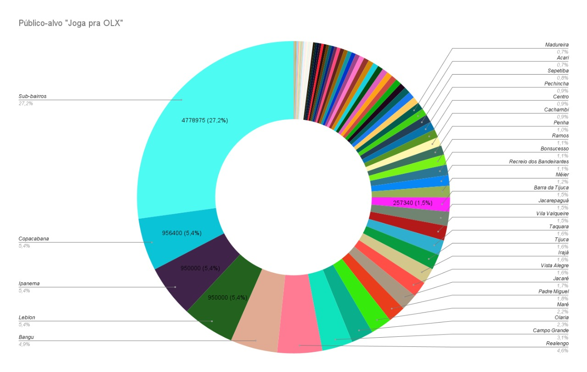
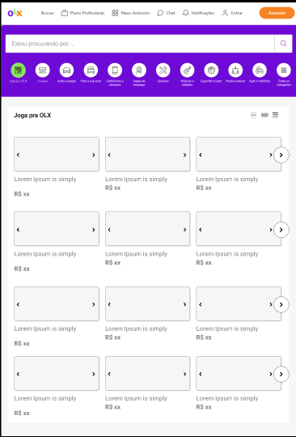
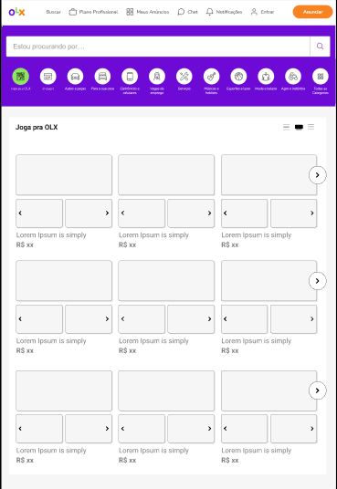
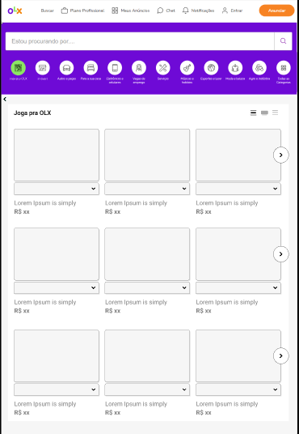
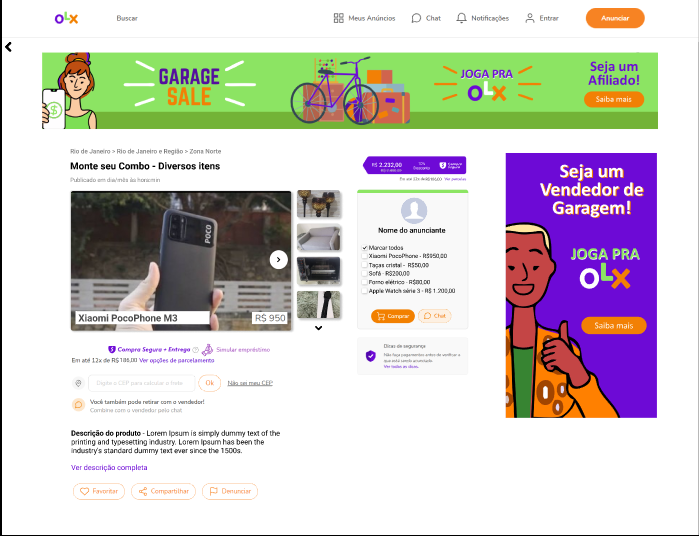
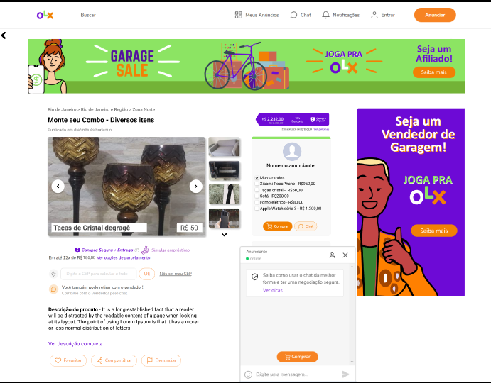

# HACKATUDO-OLX 2021

## O time - EQUIPE FINALISTA
Time formado por estudantes de Análise e Desenvolvimento de sistemas da Faculdade SENAC-RJ, o **2DLV**. O nome 2DLV vem das iniciais dos nomes dos integrantes:

- David Sena - Desenvolvedor - [LinkedIn](https://www.linkedin.com/in/daviidsena/) - [GitHub](https://github.com/daviidsena/) - [Email](mailto:daviidsena@gmail.com)
- Diogo Feital - Programador - [LinkedIn](https://www.linkedin.com/in/#/) - [GitHub](https://github.com/diogofeital/) - [Email](mailto:diiogo-_-@hotmail.com)
- Lissa Dias - Designer - [LinkedIn](https://www.linkedin.com/in/lissadias/) - [GitHub](https://github.com/LissaDias/) - [Email](mailto:lissa.dias@yahoo.com.br)
- Victor Macedo - Empreendedor - [LinkedIn](https://www.linkedin.com/in/victormacedo996/) - [GitHub](https://github.com/victormacedo996/) - [Email](mailto:victormacedo996@gmail.com)

Somos um time motivado e em buscas de novos desafios, juntando *Know Hows* e experiências diferentes de cada um dos integrantes topamos os desafios do Hacktudo OLX 2021 e com certeza não pararemos por aí.

## O desafio HACKTUDO OLX 2021

No dia 15/10/2021 nos foi introduzido o tema: Venda e consumo inteligente e sustentável em larga escala. Sendo assim, bolamos uma ideia de negócios para apresenta-las aos mentores no dia 16/10/2021 e o projeto foi submetido às 11h do dia 17/10/2021. No próprio dia 17/10/2021 tivemos a notícia de que seríamos finalistas para melhorar ainda mais a ideia e apresentá-la na final do dia 23/10/2021.

- [Video da apresentação eliminatória](https://www.youtube.com/watch?v=qunGDitMZDw).
- [Apresentação em PDF](https://github.com/victormacedo996/hacktudo-olx/blob/main/Vendas%20de%20Garagem%20-%202DLV%20-%20Hackatudo%20OLX%202021.pdf).
- [Apresentação do pitch](https://youtu.be/vb3qH5NBwnk).

## Apresentação da ideia

A partir de uma pesquisa de benchmark feita no Facebook nos diversos grupos de compra e venda da cidade do Rio de Janeiro, conseguímos identificar 455 grupos com aproximadamente 4 milhões de membros ao todo, seccionado por área descrito no gráfico abaixo:

Sendo assim, foi percebida uma necessidade entre os vendedores e consumidores de se desfazer de muitos itens de uma só vez, assim como pessoas interessadas em comprá-los.

Inspirados em um hábito muito comum nos EUA e na Europa, as vendas de garagens, nas quais aqueles que querem se desfazer de diversos itens os anunciam na porta de casa, ou em suas garagens, por um preço bem abaixo o mercado com o intruito de se livrar daqueles itens. Ou seja, desapegaram e desejam que o item tenha um destino o quanto antes. 

Dessa forma, nossa proposta consiste em criar uma nova categoria de anuncio, o Joga pra OLX. Dentro desta categoria os anunciantes poderão criar suas garagens que:

- Contenha diversos itens por garagem;
- Seja possível o vendedor ceder um desconto para quem arrematar toda a garagem;
- Oferecer a opção de vender os produtos por um preço cheio, cada item com valor fixo, ou um leilão;
- Faça *match* por proximidade;
- Promova o marketing de afiliados, aumentando o marketing orgânico.

A partir das características citadas acima, temos como objetivo:

- Reinventar a compra e venda coletiva, introduzindo a cultura das vendas de garagem de forma inovadora no Brasil;
- Descentralizar a economia;
- Fomentar a sustentabilidade social e econômica e ambiental aumentado a acessibilidade pelo comercio local e economizando matéria prima, respectivamente.

Com relação aos diferencias frente aos anuncios normais que já existem na plataforma da OLX, nós visamos:

- Permitir que o vendedor dê um desconto para quem arrematar toda a garagem de uma só vez; 
- Incentivar o marketing orgânico por meio de links afiliados, intermediado pela olx e contratado pelo vendedor;
- *Match* por proximidade pela localização do comprador, facilitando o processo de compra e venda;
- Visando a segurança, a entrega dos produtos pode ser feita pelos parceiros **ECO** que são empresas focadas em fretes com meios ecologicamente corretos.

## Protótipo navegável

Foi desenvolvido um protótipo navegável afim de facilitar o desenvolvimento da interface com o usuário. [Clicando neste link](https://www.figma.com/proto/UHxvNSgpzngHiX6gOJZPpt/Joga-pra-OLX-Vendas-de-Garagem-2DLV?node-id=194%3A769&scaling=scale-down&page-id=0%3A1&starting-point-node-id=194%3A769) você poderá testar a interface projetada.

### Index

Em comparação com o index padrão da OLX, foi adicionado um botão de categoria para o Joga pra OLX e adicionado três opções de cards que o usuário pode escolher como que ficará mais agrdável sua visualização, melhorando assim a experiência do usuário.

Opção de card com rolagem lateral, como um carrousel simples parada cada garagem.

Opção de card com rolagem lateral, porém, com três imagens sendo apresentadas em cada slide.

Opção de card com rolagem vertical, como um carrousel simples.

### Tela da garagem

A tela de caragem possui um card no qual o nome e valor de cada item é mostrado em sobreposição com a foto do item, no canto direito o usuário tem a opção de selecionar quais itens deseja comprar. Também foi projetado um padrão de anuncio para engajar mais usuários a vender seus itens demonstrado no canto superior e um padrão de anuncio para que o usuário entre como afiliado.

Chat ativo para retirar dúvidas em tempo real com o anunciate.

## FAQ dos mentores

**Questionamento:** Como funcionaria o *match* entre distância e compra de produto? E o que são os parceiros ECO?

**Resposta:** A recomendação de vendedores e compradores se dará por meio da distancia entre o comprador e o vendedor. Sendo possível ter a opção de solicitar a entrega a partir dos parceiros ECO que são empresas focadas em fretes utilizando meios ecologicamente corretos, ou uma pessoal como eu e você, como já praticado pelo iFood, Rappi ou Uber Eats, por exemplo.

##

**Questionamento:** Quem vai pagar pelos descontos?

**Resposta:** Os descontos serão dados pelo próprio vendedor de forma a estimular que todos os seus itens sejam vendidos de uma vez só. Agilizando o processo de venda e girando mais rapidamente o capital. 

##

**Questionamento:** Quem vai pagar o frete?

**Resposta:** Quem pagará por esse frete, e caso queira, será o comprador. Temos o programa de Parceiros ECO onde oferecemos meios de transporte sustentáveis. Dessa forma, gerando o menor impacto ambiental possível.

##

**Questionamento:** Preço sugerido, leilão ou doação?

**Resposta:** O vendedor pode optar por, ao invés de somente cobrar um preço fixo para sua garagem dar a opção de realizar um leilão no qual o comprador com o maior lance levará toda a garagem. Por exemplo: dar um lance que seja R$1,00 maior que o último lance, ou levar toda a garagem na hora por R$XX,XX. Assim como, para estimular a velocidade com a qual a venda é feita, o próprio vendedor pode dar de brinde um determinado item, no maior estilo leva 3 pague 2.

##

**Questionamento:** Qual é o nicho de mercado vocês miram?

**Resposta:** Pessoas que estejam de mudança e queiram se desfazer ou adquirir moveis e eletrodomésticos, nômades digitais, solteiros, casais jovens, pessoas que queiram economizar.

##

**Questionamento:** Quem vai pagar o afiliado e qual o impacto? Quais as formas de monetização?

**Resposta:** O vendedor poderá optar por pagar por um anuncio premium que o dará direito que pessoas cadastradas na plataforma da OLX distribuam o link em todas as suas redes de forma a agilizar o processo de venda. Neste caso, o anunciante pagará a OLX por esse recurso e a OLX terá o controle de quanto irá pagar ao afiliado, tendo como base o dinheiro recolhido do anunciante.

##

**Questionamento:** Vai ter avaliação da garagem?

**Resposta:** A avaliação da garagem será feita por meio da reputação do vendedor, sendo calculada a partir de alguns fatores como: relação compras entregue / compras não entregues e avaliação dos próprios usuários da plataforma em relação ao anunciante específico.

##

**Questionamento:** Como funcionaria a dinâmica de preço cheio, leilão e/ou itens individuais?

**Resposta:** O preço cheio e o leilão será feito tendo como base toda a garagem. Já os itens individuais podem ser comprados somente pelo valor total de cada item e sem desconto algum, uma vez que a ideia é estimular a venda de todos os itens o mais rápido possível.

##

**Questionamento:** Caso sejam comercializados itens de consumo, como ficaria o pagamento do ICMS?

**Resposta:** Considerando que o ICMS é cobrado diretamente na nota fiscal, é pago por parte do vendedor quando faz o compra do material a ser revendido e o mercado de usados é totalmente informal não passando por nenhum órgão regulador, o pagamento de ICMS só seria uma preocupação para a OLX caso ela própria vendesse algum item. Porém, o nicho de mercado da OLX é somente ligar quem quer vender a quem quer comprar, somente, as vezes, intermediando o pagamento através do OLX Pay. Sendo assim, a preocupação com pagamento de ICMS por parte da OLX é infundada, tendo como alvo da legislação fiscal os indivíduos ou empresas que sonegam os tributos regionais e federais.

##

**Questionamento:** Caso a pessoa queira comprar parcelado também poderia?

**Resposta:** Sim, para aumentar o acesso a crédito, principalmente em um momento difícil o qual nos encontrados, caso o pagamento seja feito por meio do OLX Pay. Nesse caso, o vendedor deve indicar se aceita ou não o pagamento parcelado sendo pago pela OLX Pay independente da inadimplência do comprador, ou a OLX Pay financiar a compra. Caso a segunda opção seja a escolhida, abre-se um novo nicho de mercado para a OLX, assim como Americanas, Tim, dentre outras.

##

**Questionamento:** Porque utilizar a estratégia de links afiliados?

**Resposta:** Com o aumento da cultura de nômades digitais e do home office, o uso de links afiliados com os quais os afiliados receberão uma comissão estimula um mercado paralelo de anunciantes OLX no maior estilo Uber, 99, dentre outros no qual irá trazer compradores para a plataforma de modo exponencial. Sendo, vantagem para o afiliado que receberá uma comissão para cada venda efetivada com seu link, para o vendedor que irá concluir a venda mais rapidamente e para a OLX que terá um sistema de vendas rápidas e atrativa, cobrando por esse serviço de afiliados.

##

**Questionamento:** Como será feito o desconto progressivo?

**Resposta:** O anunciante poderá programar um desconto progressivo levando em consideração a quantidade de itens selecionados para serem comprados de uma vez só. Estimulando que todos os itens sejam vendidos de forma conjunta por um preço mais baixo, porém, mais rapidamente, receber um valor maior, porém, demorando mais tempo para vender todos os itens.

##

## Referências

- https://github.com/victormacedo996/hacktudo-olx

- https://www.olx.com.br/
- https://www.lipsum.com/
- https://icons.getbootstrap.com/
- https://fonts.google.com/specimen/Nunito+Sans
- https://www.hotmart.com/pt-BR/affiliates
- https://baianat.github.io/hooper/examples.html#default-example
- https://br.freepik.com/home
- https://www.flaticon.com/br/icone-gratis/venda-de-garagem_1974062
- https://www.reclameaqui.com.br/olx/anuncios-com-o-preco-r-0-00_-yJwrQ_LthUzFQU9/
- https://www.facebook.com/groups/search/groups?q=joga%20pra%20rolo&filters=eyJmaWx0ZXJfZ3JvdXBzX2xvY2F0aW9uOjAiOiJ7XCJuYW1lXCI6XCJmaWx0ZXJfZ3JvdXBzX2xvY2F0aW9uXCIsXCJhcmdzXCI6XCIxMTAzNDY5NTU2NTM0NzlcIn0ifQ%3D%3D
- https://rj.olx.com.br/norte-do-estado-do-rio/imoveis/apartamento-residencial-em-macae-rj-riviera-fluminense-926224602
- https://rj.olx.com.br/rio-de-janeiro-e-regiao/eletrodomesticos/pecas-geladeira-brastemp-ative-937693417
- https://www.reclameaqui.com.br/olx/anuncios-com-o-preco-r-0-00_-yJwrQ_LthUzFQU9/
- https://jamboard.google.com/d/1WTfz3Gy-kTSb5mzO7SqhwbArQ5VnK377NnUjQ0pHsUw/edit?usp=sharing
- https://brasil.un.org/pt-br/sdgs
